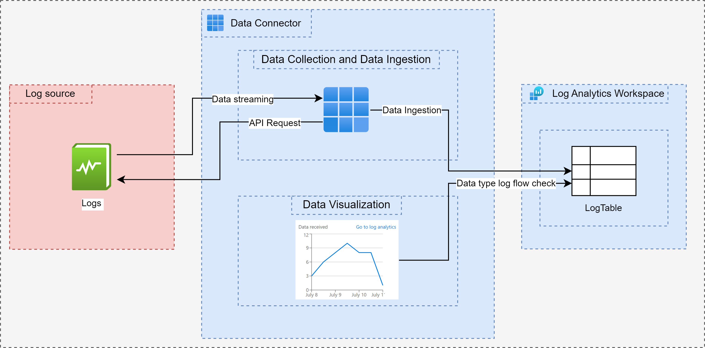
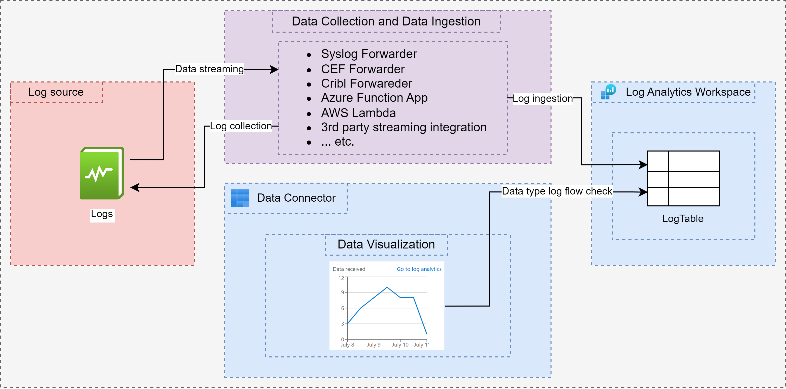

# Data Connector
A component in Microsoft Sentinel that allows the users to COLLECT logs from Microsoft, Azure, or a 3rd party platform (depending on the integration capabilities and support) and INGEST into Microsoft Sentinel's Log Analytics Workspace. Data Connectors on a high level does the following three actions:

* Data Collection
* Data Ingestion
* Data Visualization

 

# Functional (Active) Data Connector

Functional Data Connector is a type of data connector in Sentinel that is capable of performing all the above three in it by itself. A Functional Data Connector DOES NOT require an extra component from Azure/3rd party environment to do the data collection and data ingestion part.

Some examples of a Functional Data Connector are:

* Azure Active Directory
* Azure Active Directory Identity Protection
* Microsoft 365 Defender
* Microsoft Defender Data Connectors (MDC, MDE, MDO, etc.)
* Office 365
* Custom Data Connectors of kind "API Polling"

 

# Monitoring (Passive) Data Connector

Monitoring Data Connector is a type of data connector in Sentinel that is capable of performing ONLY Data Visualization. These data connectors by themselves CANNOT perform Data Collection or Data Ingestion via a connect or disconnect button. Instead, a solution in the background is responsible for handling the actual log ingestion process, while the data connector serves the purpose of visualizing the log flow from the source platform to Microsoft Sentinel.

Most of these Monitoring Data Connectors have an Instructions Page in them that tells an engineer how to configure the solution in the background to collect and ingest the logs from source platform to Microsoft Sentinel.

Some examples of Monitoring Data Connectors are:
* Syslog
* Common Event Format
* Azure Activity
* SentinelOne
* Custom Data Connectors of kind "GenericUI"

 

# Conclusion
The easiest way to differentiate a Functional Data Connector from a Monitoring Data Connector is by opening the appropriate connector page and looking for a "Connect" or "Disconnect" button in it. If the connector page doesn't have any connection configuration in it - it is safe to assume that it is a Monitoring Data Connector.

Due to the growing complexities of integration, identifying data connectors with a Connect/Disconnect button isn't reliable anymore. It is also advised to validate the data connector type by understanding how the data connector works in terms of data collection and data ingestion, with which we can determine the type of the data connector.